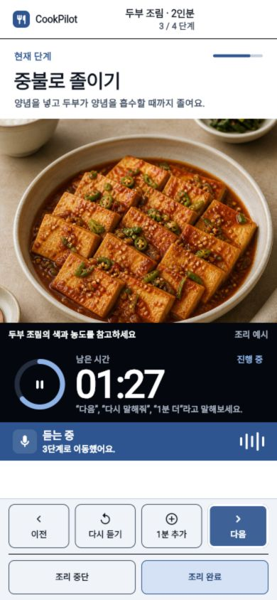
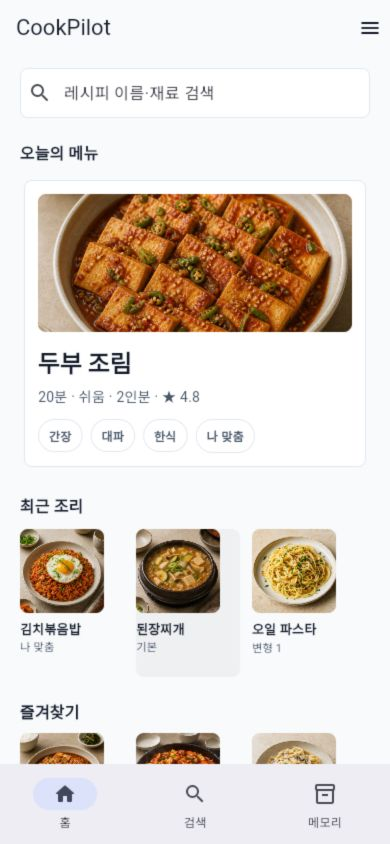
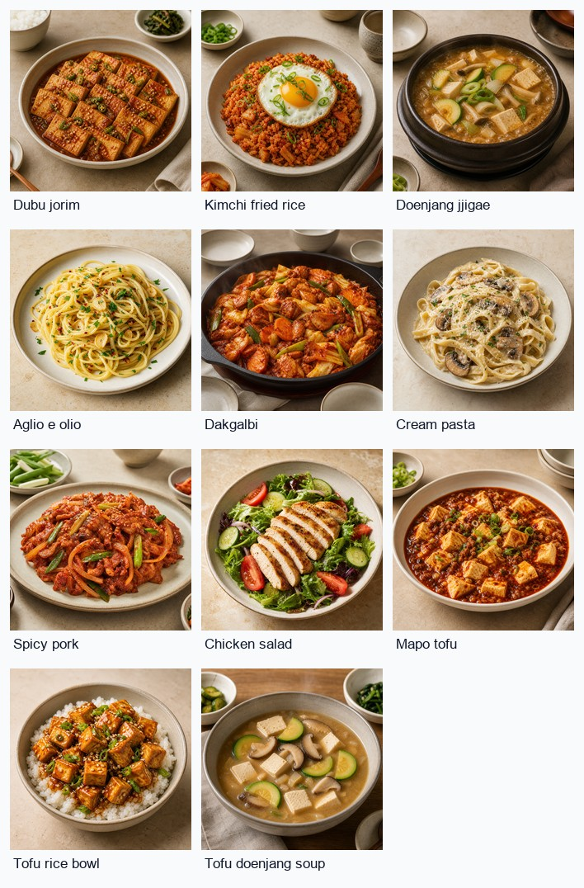
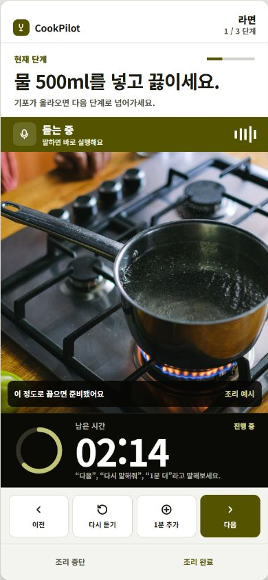
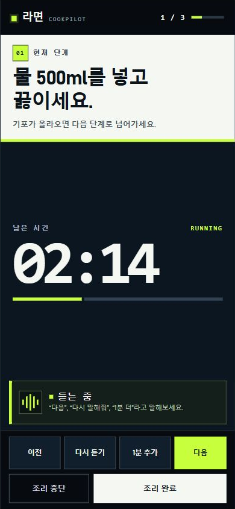
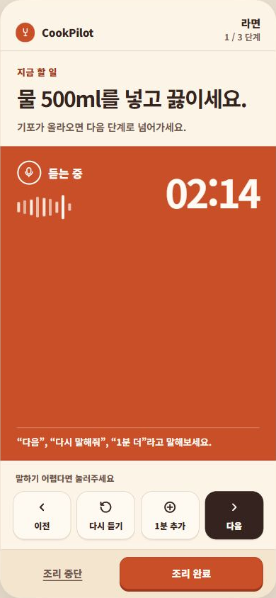
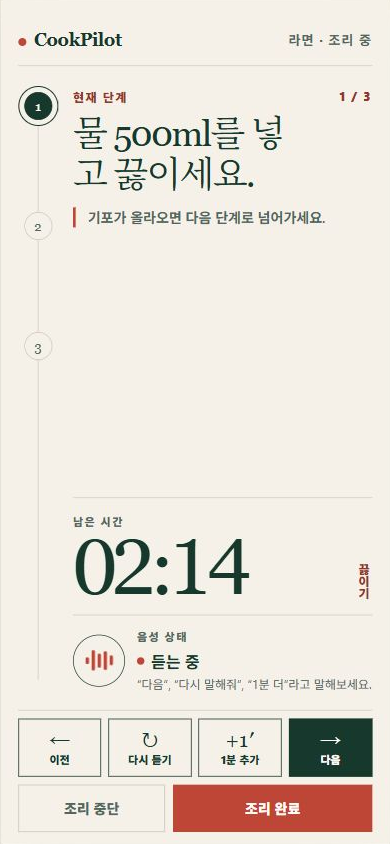
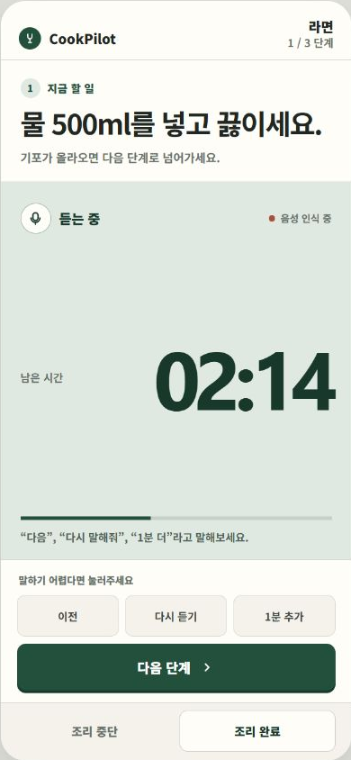
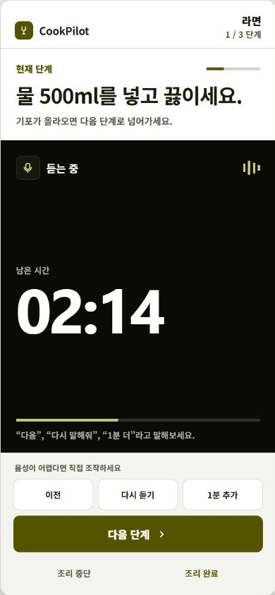

# CookPilot S-03 조리 가이드 디자인 비교

이 폴더는 조리 중 화면 하나를 여러 방향으로 탐색하고, 팀원이 GitHub에서 바로 비교할 수 있도록 정리한 디자인 산출물입니다. 현재 Flutter 구현은 `Shotgun D → Impeccable` 결합안을 기준으로 합니다.

## 팀 Flutter 앱 실제 구현

<p align="center">
  
</p>

기존 팀 앱의 `조리 설정 → 조리 중 → 조리 후 리뷰` 흐름을 유지하면서 조리 중 화면만 교체했습니다. 위 이미지는 Chrome에서 팀 Flutter 앱을 390×844로 직접 실행해 캡처한 결과입니다.

## 레시피별 임시 이미지

<p align="center">
  
</p>

<p align="center">
  
</p>

홈·검색·상세에 노출되는 고유 메뉴 11개에 서로 다른 이미지를 연결했습니다. 생성 도구와 공통·음식별 프롬프트는 [`recipe-image-prompts.md`](recipe-image-prompts.md)에 기록했습니다.

## 최종 구현 기준안

<p align="center">
  
</p>

- 선택 결과: 결합안 H, 사용자 평가 4/5
- 유지한 요소: 실제 조리 미디어, 높은 타이머 가독성, 명확한 음성 상태, 네 개의 동일 위치 fallback 조작
- 보정한 요소: 강한 파란색을 낮추고 중단/완료 버튼의 식별성을 강화
- 인터랙티브 원본: [`combined-D-impeccable.html`](combined-shotgun-D-impeccable/combined-D-impeccable.html)

## Shotgun 초기 후보 A–D

<table>
  <tr>
    <td align="center"><br /><strong>A · 명령 중심</strong></td>
    <td align="center"><br /><strong>B · 음성 중심</strong></td>
    <td align="center"><br /><strong>C · 단계 중심</strong></td>
    <td align="center"><br /><strong>D · 계기판 중심</strong></td>
  </tr>
</table>

- A–C 1차 비교판: [`design-board.html`](design-board.html)
- B/D 리믹스 비교판: [`remix-board.html`](remix-board.html)
- 평가 기준: [`evaluation-rubric.md`](evaluation-rubric.md)

## 세 가지 실험 경로

<table>
  <tr>
    <td align="center"><br /><strong>Shotgun 단독</strong></td>
    <td align="center"><br /><strong>PRODUCT.md → Impeccable</strong></td>
    <td align="center"><br /><strong>Shotgun D → Impeccable</strong></td>
  </tr>
</table>

전체 비교판은 [`final-comparison-board.html`](final-comparison-board.html)에서 확인할 수 있습니다.

## 사용한 모델과 도구

| 구분 | 실제 사용 | 역할 |
| --- | --- | --- |
| 텍스트·코드 모델 | OpenAI Codex (GPT-5) | PRODUCT.md와 확정 MVP를 바탕으로 HTML 후보, Flutter 코드, 테스트, 문서를 작성 |
| 디자인 탐색 스킬 | gstack `design-shotgun` | Codex가 A–D 변형, 비교판, 피드백 수집 흐름을 만드는 데 사용한 workflow이며 별도 모델이 아님 |
| 디자인 정제 스킬 | `Impeccable` | Codex가 제품 UI 원칙에 따라 독립안과 선택된 D안의 위계·색상·조작 구조를 정제하는 데 사용한 skill이며 별도 모델이 아님 |
| 레시피 이미지 | OpenAI 내장 `image_gen.imagegen` + `imagegen` skill | 홈·검색·상세·조리 화면의 임시 메뉴 사진 11개 생성. 결과 메타데이터 식별자는 `gpt-imagegen` v2.0이며 public API 모델명은 노출되지 않음 |
| 렌더링 검증 | Codex Browser / Chrome | 390×844 기준 HTML과 Flutter 웹 렌더링 확인 및 스크린샷 캡처 |
| 구현 | Flutter 3.44.6 / Dart 3.12.2 | 팀 앱의 기존 조리 설정 → 리뷰 흐름 안에 S-03 화면 통합 |
| Android 도구 체인 | Android SDK 36 / JDK 17 | `flutter doctor -v`로 SDK/JDK 인식과 라이선스를 확인. APK 빌드는 이번 PR에서 미수행 |

초기 Shotgun 후보 생성 때는 Windows 환경에서 이미지 생성 바이너리를 사용할 수 없어 Codex가 HTML 목업을 만드는 fallback 경로를 썼습니다. 이후 실제 앱의 메뉴 구분을 위해 내장 이미지 생성 도구로 임시 레시피 사진 11개를 별도 생성했습니다. 초기 비교안의 냄비 사진은 Pexels 탐색용 자산이며 앱 구현에서는 생성한 두부 조림 이미지로 교체했습니다. `Taste Skill`은 이번 디자인 생성·정제 과정에 사용하지 않았습니다.

## 로컬에서 인터랙티브 비교판 보기

저장소 루트에서 다음 명령을 실행합니다.

```powershell
python -m http.server 8765 --bind 127.0.0.1 --directory docs/design-preview/cooking-guide
```

브라우저에서 아래 주소를 엽니다.

```text
http://127.0.0.1:8765/final-comparison-board.html
http://127.0.0.1:8765/combined-shotgun-D-impeccable/combined-D-impeccable.html
```

단순 정적 서버에서는 비교판을 볼 수만 있고 선택 결과는 저장되지 않습니다. 의견과 선택은 PR 코멘트로 남겨주세요.

## 현재 한계

- STT, TTS, 예외 질문 API는 실제 서비스 어댑터가 아닌 demo adapter입니다. 버튼 fallback과 상태 전이는 동작합니다.
- 팀 앱의 두부 조림 데이터와 신규 조리 화면 사이에는 임시 변환 계층을 사용합니다. 서버 모델에 `completionCue`, 단계 미디어, 안정적인 recipe/version ID가 추가되면 교체해야 합니다.
- 생성한 메뉴 사진 11개는 목업용 임시 자산입니다. 출시 전 팀이 승인한 레시피 전용 이미지·영상·GIF로 교체해야 합니다.

## 이미지 출처

- 초기 디자인 비교안 사진: Anna Shvets, “Close-up of boiling water in a stainless steel pot on a gas stove”
- 출처: <https://www.pexels.com/photo/boiling-water-in-pot-on-burner-12673645/>
- 원 출처에 표시된 상태: free to use
